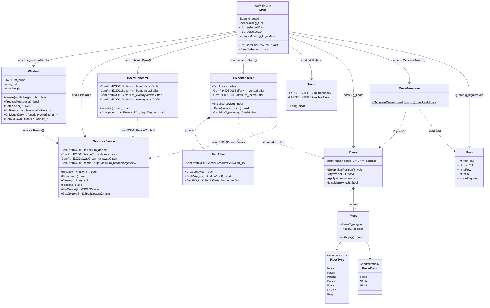
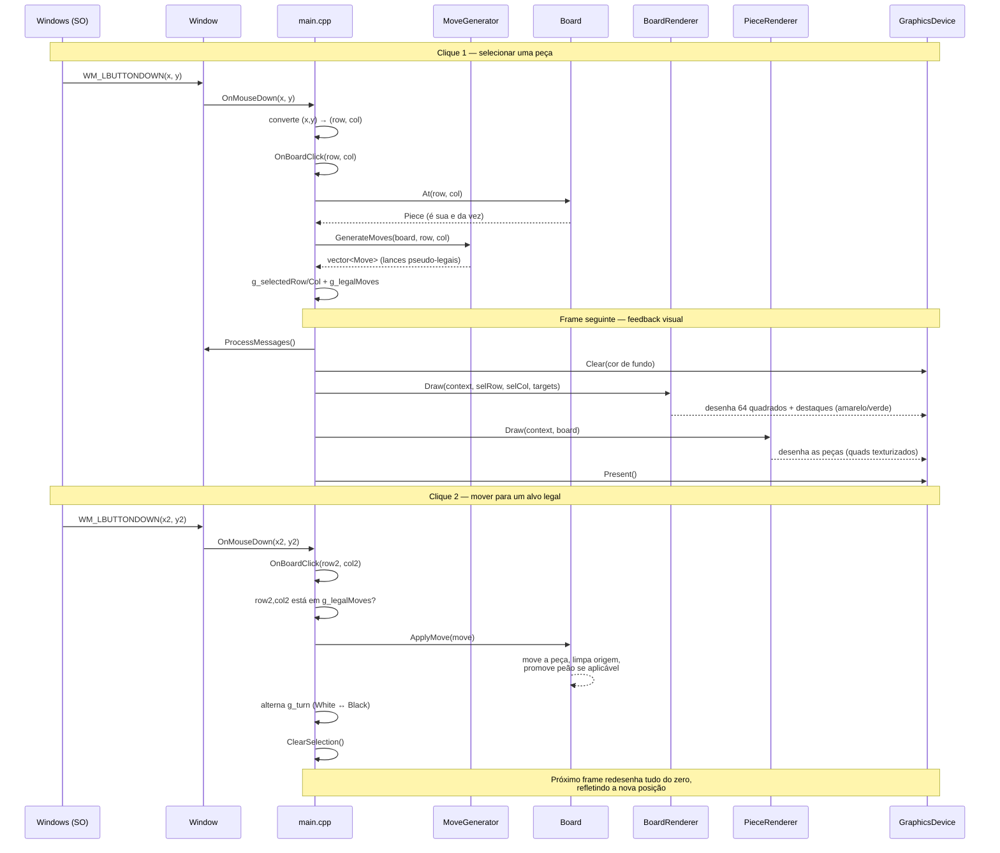

# Arquitetura do Jogo de Xadrez Didático

Este documento apresenta o diagrama de classes UML do projeto, um diagrama
de sequência do fluxo de um lance completo, e a explicação de como as
peças se conectam em tempo de execução.

---

## 1. Diagrama de Classes



**Como ler as setas:** `-->` (seta cheia) indica que uma classe *possui ou
controla* a outra; `..>` (seta tracejada) indica uma *dependência de
leitura/uso*, sem posse; `*--` indica *composição* (o todo não existe sem
as partes — um `Board` sem `Piece` não faz sentido).

---

## 2. Diagrama de Sequência — um lance completo



---

## 3. Explicação do fluxo, por etapa

### 3.1 Inicialização (uma única vez)

A ordem de criação em `wWinMain` é uma cadeia de dependências:

```
Window  →  GraphicsDevice  →  BoardRenderer / PieceRenderer
(precisa    (precisa do        (precisam do ID3D11Device
 de nada)    HWND da janela)    criado pelo GraphicsDevice)
```

Cada `Initialize()` só pode ser chamado depois que a etapa anterior
retornou `true`. Se qualquer uma falhar, o programa encerra com `-1` em
vez de continuar com ponteiros DirectX inválidos.

### 3.2 O game loop (repete a cada frame)

```
ProcessMessages()  →  Clear()  →  BoardRenderer::Draw()  →  PieceRenderer::Draw()  →  Present()
```

`ProcessMessages()` é o que faz a janela responder ao Windows — e é
*indiretamente*, através da fila de mensagens, que um clique do mouse
acaba chamando `OnBoardClick`. O `deltaTime` do `Timer` já é calculado
todo frame, mas ainda não é consumido por nada (fica reservado para
animações futuras de movimento).

### 3.3 A camada que nunca muda: `game/`

`Board`, `Piece`, `Move` e `MoveGenerator` não incluem nada de DirectX.
Eles representam o estado do xadrez como dados puros (uma matriz 8×8 de
`Piece`) e regras puras (funções que leem esse estado e devolvem listas
de `Move` válidos). Isso significa que, em teoria, você poderia escrever
testes automatizados para `MoveGenerator::GenerateMoves` sem nunca abrir
uma janela — a lógica do jogo é completamente independente de como ela é
desenhada.

### 3.4 A camada que traduz estado em pixels: `render/`

`BoardRenderer` e `PieceRenderer` nunca modificam `Board` — eles só o
leem (setas tracejadas `..>` no diagrama de classes). A cada frame, eles
reconstroem a geometria do zero a partir do estado atual:

- `BoardRenderer` sempre desenha os mesmos 64 quadrados (geometria
  estática, criada uma única vez), mas recalcula os destaques (seleção e
  alvos legais) a cada frame, porque esses mudam com a interação.
- `PieceRenderer` varre a matriz inteira do `Board` a cada frame e gera
  um quad texturizado para cada casa ocupada, usando as coordenadas UV
  que `TextAtlas` calcula para cada tipo de peça.

### 3.5 O ponto de encontro: `main.cpp`

`main.cpp` é a única parte do código que conhece **tanto** `game/`
quanto `render/` — é ele quem lê o clique, pergunta ao `MoveGenerator`
quais são os lances válidos, aplica o lance escolhido no `Board`, e then
passa esse mesmo `Board` para os renderizadores desenharem. Nem `game/`
nem `render/` se conhecem diretamente; `main.cpp` é a "cola" entre eles —
isso é o que o diagrama de classes expressa com `Main` sendo a única
classe com setas cheias (posse) apontando para praticamente tudo.

---

## 4. Onde ficam os "buracos" propositais

Como vimos em conversas anteriores, `MoveGenerator` gera apenas lances
**pseudo-legais**. No diagrama de sequência acima, isso corresponde ao
passo `MG-->>Main: vector<Move>` — nenhuma verificação de xeque acontece
ali. Implementar essa verificação adicionaria uma nova dependência no
diagrama: `MoveGenerator` (ou uma nova classe `LegalMoveFilter`) passaria
a depender de uma cópia temporária de `Board` para simular cada lance
antes de confirmá-lo como legal.

---

## 5. Referência: o que cada classe faz

### 5.1 Camada `engine/` — motor genérico, não sabe o que é xadrez

#### `Window` (`Window.h` / `Window.cpp`)
Encapsula a criação e o ciclo de vida de uma janela Win32. É a única
classe que fala diretamente com a API `<windows.h>` (`RegisterClassEx`,
`CreateWindowEx`, `WndProc`). Sua responsabilidade é **traduzir mensagens
do Windows em eventos de alto nível**: em vez de forçar quem usa a classe
a escrever um `switch(msg)`, ela expõe três `std::function` —
`OnResize`, `OnMouseDown`, `OnKeyDown` — que `main.cpp` preenche com
lambdas. Também guarda `m_width`/`m_height` atualizados a cada
`WM_SIZE`, usados pelo cálculo de picking do mouse.

#### `GraphicsDevice` (`GraphicsDevice.h` / `GraphicsDevice.cpp`)
Encapsula os quatro objetos centrais do DirectX 11: `ID3D11Device`
(fábrica de recursos — buffers, texturas, shaders), `ID3D11DeviceContext`
(emite comandos de desenho), `IDXGISwapChain` (par de buffers de tela) e
`ID3D11RenderTargetView` (a "view" de escrita sobre o back buffer).
Nenhuma outra classe do projeto cria esses objetos — todas recebem
`ID3D11Device*`/`ID3D11DeviceContext*` a partir daqui. Expõe quatro
operações: `Initialize` (monta tudo), `Resize` (recria a render target
quando a janela muda de tamanho), `Clear` (pinta o fundo) e `Present`
(mostra o frame desenhado na tela).

#### `Timer` (`Timer.h` / `Timer.cpp`)
Classe pequena e de responsabilidade única: mede quantos segundos se
passaram desde a última chamada de `Tick()`, usando o contador de alta
resolução do Windows (`QueryPerformanceCounter`). Hoje o `deltaTime` que
ela produz é calculado em `main.cpp` mas descartado (`(void)deltaTime`)
— está pronta para o dia em que você implementar movimento animado das
peças.

#### `ShaderUtils.h` (função utilitária, não é uma classe)
Contém `CompileShaderFromFile`, uma função livre que chama
`D3DCompileFromFile` para compilar um `.hlsl` em tempo de execução e
imprime o erro de compilação (se houver) na janela "Output" do Visual
Studio. É reaproveitada tanto por `BoardRenderer` quanto por
`PieceRenderer` para não duplicar esse código.

#### `TextAtlas` (`TextAtlas.h` / `TextAtlas.cpp`)
Gera, na inicialização, uma única textura contendo as letras `P N B R Q
K` desenhadas via GDI, convertendo a luminância do texto em canal alfa
(veja a explicação detalhada na conversa anterior sobre o pipeline
gráfico). Expõe `GetUV(glyph, ...)`, que devolve as coordenadas de
textura (0 a 1) de uma letra específica dentro do atlas, e `GetSRV()`,
que devolve o recurso de textura pronto para ser amostrado no pixel
shader. É uma dependência interna de `PieceRenderer` — nenhuma outra
classe a usa diretamente.

### 5.2 Camada `game/` — regras do xadrez, não sabe o que é DirectX

#### `Piece` (`Piece.h`, struct)
O dado mais simples do projeto: um par `PieceType` + `PieceColor`. Não
tem comportamento além de `IsEmpty()`. É intencionalmente um "POD"
(*plain old data*) — copiável, sem ponteiros, sem efeitos colaterais —
para que copiar um `Board` inteiro (necessário ao simular lances) seja
uma operação trivial e segura.

#### `Move` (`Board.h`, struct)
Representa um lance candidato: casa de origem, casa de destino, e se é
uma captura. É o "contrato" entre `MoveGenerator` (que produz `Move`s) e
`Board::ApplyMove` (que os consome). Também é o dado que viaja até
`main.cpp` para alimentar a lista `g_legalMoves` e, por extensão, os
destaques verdes desenhados pelo `BoardRenderer`.

#### `Board` (`Board.h` / `Board.cpp`)
O estado completo de uma partida: uma matriz `8×8` de `Piece`.
Responsabilidades: `SetupInitialPosition()` (posiciona as 32 peças no
início do jogo), `At(row, col)` (acesso de leitura/escrita a uma casa),
`IsInside(row, col)` (checagem estática de limites, usada por todo
`MoveGenerator`) e `ApplyMove(move)` (efetua um lance — move a peça,
esvazia a origem, e promove peão a rainha automaticamente ao alcançar a
última fileira). Não tem nenhuma noção de "de quem é a vez" ou "isso é
legal" — isso é responsabilidade de quem chama.

#### `MoveGenerator` (`MoveGenerator.h` / `MoveGenerator.cpp`)
Uma classe sem estado (só métodos `static`) cuja única função pública é
`GenerateMoves(board, row, col)`: dado um tabuleiro e uma casa, devolve
todos os lances pseudo-legais daquela peça. Internamente usa duas
funções auxiliares privadas (`TryAddSlide` para peças que deslizam —
bispo, torre, rainha — e `TryAddStep` para peças de passo fixo — cavalo,
rei) mais um bloco específico para o peão, que é a única peça cujo
padrão de movimento e de captura diferem. **Não verifica xeque** — essa é
a limitação conhecida documentada na Seção 4.

#### `PieceType` / `PieceColor` (`Piece.h`, enums)
Os dois enums que classificam uma peça: `PieceType` (`None, Pawn,
Knight, Bishop, Rook, Queen, King`) e `PieceColor` (`None, White,
Black`). O valor `None` em ambos existe para representar uma casa vazia
sem precisar de um tipo `std::optional` ou de um ponteiro nulo.

### 5.3 Camada `render/` — traduz o estado do jogo em geometria na tela

#### `BoardRenderer` (`BoardRenderer.h` / `BoardRenderer.cpp`)
Desenha duas coisas em cada frame: (1) os 64 quadrados do tabuleiro,
como geometria **estática** criada uma única vez em `Initialize`
(`D3D11_USAGE_IMMUTABLE`, já que as cores das casas nunca mudam), e (2)
os destaques de seleção/alvos legais, como geometria **dinâmica**
(`D3D11_USAGE_DYNAMIC` + `Map`/`Unmap`) reconstruída a cada chamada de
`Draw`, porque essa muda a cada clique do jogador. Possui seu próprio
par de vertex/pixel shader (`BoardVS.hlsl`/`BoardPS.hlsl`) e seu próprio
`ID3D11InputLayout`, independentes dos usados por `PieceRenderer`.

#### `PieceRenderer` (`PieceRenderer.h` / `PieceRenderer.cpp`)
Desenha as peças presentes no `Board` como quads texturizados. A cada
`Draw`, varre a matriz `8×8` inteira, e para cada casa ocupada gera um
quad com as coordenadas UV corretas (obtidas de `TextAtlas::GetUV`) e
uma cor de tingimento (quase branco ou quase preto, conforme
`piece.color`). Possui internamente uma instância de `TextAtlas`, seu
próprio par de shaders (`PieceVS.hlsl`/`PiecePS.hlsl`), sampler e estado
de blend (necessário para as bordas transparentes das letras).

### 5.4 Orquestração — `main.cpp`

Não é uma classe, mas concentra o **estado global da partida em
andamento** (`g_board`, `g_turn`, `g_selectedRow/Col`, `g_legalMoves`,
todos em um `namespace` anônimo) e duas funções: `OnBoardClick` (a
máquina de estados de seleção → movimento, detalhada na Seção 3) e
`wWinMain` (o ponto de entrada: cria as instâncias de `Window`,
`GraphicsDevice`, `BoardRenderer` e `PieceRenderer`, conecta os
callbacks da janela, e roda o game loop). É a única parte do código que
importa tanto `game/` quanto `render/` — a "cola" que o diagrama de
classes da Seção 1 mostra através das setas cheias saindo de `Main`.
