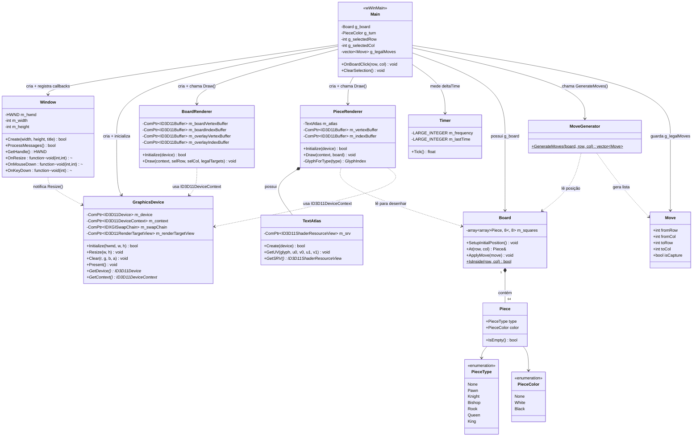
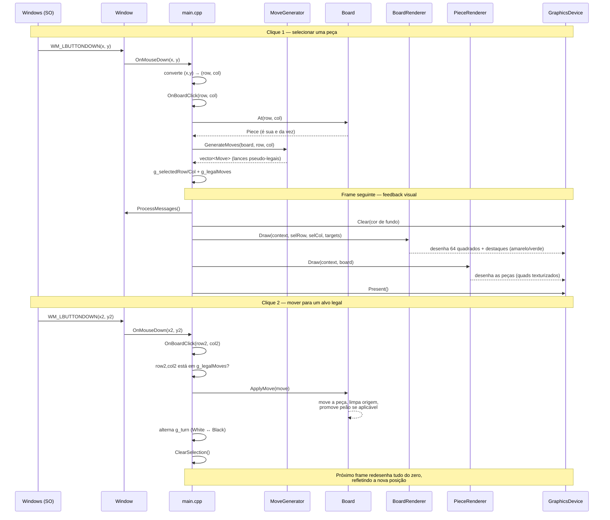
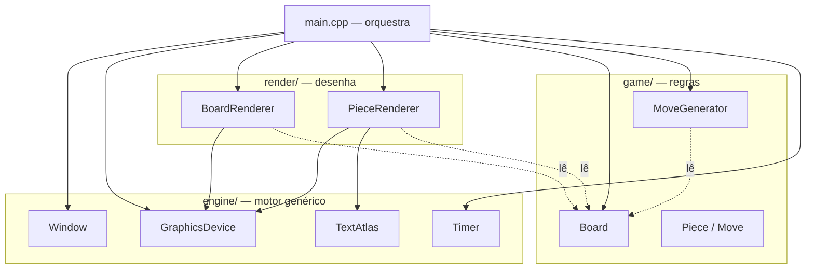

# Arquitetura do Jogo de Xadrez Didático

Este documento apresenta o diagrama de classes UML do projeto, um diagrama
de sequência do fluxo de um lance completo, e a explicação de como as
peças se conectam em tempo de execução.

---

## 1. Diagrama de Classes



**Como ler as setas:** `-->` (seta cheia) indica que uma classe *possui ou
controla* a outra; `..>` (seta tracejada) indica uma *dependência de
leitura/uso*, sem posse; `*--` indica *composição* (o todo não existe sem
as partes — um `Board` sem `Piece` não faz sentido).

---

## 2. Diagrama de Sequência — um lance completo



---

## 3. Explicação do fluxo, por etapa

### 3.1 Inicialização (uma única vez)

A ordem de criação em `wWinMain` é uma cadeia de dependências:

```
Window  →  GraphicsDevice  →  BoardRenderer / PieceRenderer
(precisa    (precisa do        (precisam do ID3D11Device
 de nada)    HWND da janela)    criado pelo GraphicsDevice)
```

Cada `Initialize()` só pode ser chamado depois que a etapa anterior
retornou `true`. Se qualquer uma falhar, o programa encerra com `-1` em
vez de continuar com ponteiros DirectX inválidos.

### 3.2 O game loop (repete a cada frame)

```
ProcessMessages()  →  Clear()  →  BoardRenderer::Draw()  →  PieceRenderer::Draw()  →  Present()
```

`ProcessMessages()` é o que faz a janela responder ao Windows — e é
*indiretamente*, através da fila de mensagens, que um clique do mouse
acaba chamando `OnBoardClick`. O `deltaTime` do `Timer` já é calculado
todo frame, mas ainda não é consumido por nada (fica reservado para
animações futuras de movimento).

### 3.3 A camada que nunca muda: `game/`

`Board`, `Piece`, `Move` e `MoveGenerator` não incluem nada de DirectX.
Eles representam o estado do xadrez como dados puros (uma matriz 8×8 de
`Piece`) e regras puras (funções que leem esse estado e devolvem listas
de `Move` válidos). Isso significa que, em teoria, você poderia escrever
testes automatizados para `MoveGenerator::GenerateMoves` sem nunca abrir
uma janela — a lógica do jogo é completamente independente de como ela é
desenhada.

### 3.4 A camada que traduz estado em pixels: `render/`

`BoardRenderer` e `PieceRenderer` nunca modificam `Board` — eles só o
leem (setas tracejadas `..>` no diagrama de classes). A cada frame, eles
reconstroem a geometria do zero a partir do estado atual:

- `BoardRenderer` sempre desenha os mesmos 64 quadrados (geometria
  estática, criada uma única vez), mas recalcula os destaques (seleção e
  alvos legais) a cada frame, porque esses mudam com a interação.
- `PieceRenderer` varre a matriz inteira do `Board` a cada frame e gera
  um quad texturizado para cada casa ocupada, usando as coordenadas UV
  que `TextAtlas` calcula para cada tipo de peça.

### 3.5 O ponto de encontro: `main.cpp`

`main.cpp` é a única parte do código que conhece **tanto** `game/`
quanto `render/` — é ele quem lê o clique, pergunta ao `MoveGenerator`
quais são os lances válidos, aplica o lance escolhido no `Board`, e then
passa esse mesmo `Board` para os renderizadores desenharem. Nem `game/`
nem `render/` se conhecem diretamente; `main.cpp` é a "cola" entre eles —
isso é o que o diagrama de classes expressa com `Main` sendo a única
classe com setas cheias (posse) apontando para praticamente tudo.

---

## 4. Onde ficam os "buracos" propositais

Como vimos em conversas anteriores, `MoveGenerator` gera apenas lances
**pseudo-legais**. No diagrama de sequência acima, isso corresponde ao
passo `MG-->>Main: vector<Move>` — nenhuma verificação de xeque acontece
ali. Implementar essa verificação adicionaria uma nova dependência no
diagrama: `MoveGenerator` (ou uma nova classe `LegalMoveFilter`) passaria
a depender de uma cópia temporária de `Board` para simular cada lance
antes de confirmá-lo como legal.

---

## 5. Referência: o que cada classe faz

### 5.1 Camada `engine/` — motor genérico, não sabe o que é xadrez

#### `Window` (`Window.h` / `Window.cpp`)
Encapsula a criação e o ciclo de vida de uma janela Win32. É a única
classe que fala diretamente com a API `<windows.h>` (`RegisterClassEx`,
`CreateWindowEx`, `WndProc`). Sua responsabilidade é **traduzir mensagens
do Windows em eventos de alto nível**: em vez de forçar quem usa a classe
a escrever um `switch(msg)`, ela expõe três `std::function` —
`OnResize`, `OnMouseDown`, `OnKeyDown` — que `main.cpp` preenche com
lambdas. Também guarda `m_width`/`m_height` atualizados a cada
`WM_SIZE`, usados pelo cálculo de picking do mouse.

#### `GraphicsDevice` (`GraphicsDevice.h` / `GraphicsDevice.cpp`)
Encapsula os quatro objetos centrais do DirectX 11: `ID3D11Device`
(fábrica de recursos — buffers, texturas, shaders), `ID3D11DeviceContext`
(emite comandos de desenho), `IDXGISwapChain` (par de buffers de tela) e
`ID3D11RenderTargetView` (a "view" de escrita sobre o back buffer).
Nenhuma outra classe do projeto cria esses objetos — todas recebem
`ID3D11Device*`/`ID3D11DeviceContext*` a partir daqui. Expõe quatro
operações: `Initialize` (monta tudo), `Resize` (recria a render target
quando a janela muda de tamanho), `Clear` (pinta o fundo) e `Present`
(mostra o frame desenhado na tela).

#### `Timer` (`Timer.h` / `Timer.cpp`)
Classe pequena e de responsabilidade única: mede quantos segundos se
passaram desde a última chamada de `Tick()`, usando o contador de alta
resolução do Windows (`QueryPerformanceCounter`). Hoje o `deltaTime` que
ela produz é calculado em `main.cpp` mas descartado (`(void)deltaTime`)
— está pronta para o dia em que você implementar movimento animado das
peças.

#### `ShaderUtils.h` (função utilitária, não é uma classe)
Contém `CompileShaderFromFile`, uma função livre que chama
`D3DCompileFromFile` para compilar um `.hlsl` em tempo de execução e
imprime o erro de compilação (se houver) na janela "Output" do Visual
Studio. É reaproveitada tanto por `BoardRenderer` quanto por
`PieceRenderer` para não duplicar esse código.

#### `TextAtlas` (`TextAtlas.h` / `TextAtlas.cpp`)
Gera, na inicialização, uma única textura contendo as letras `P N B R Q
K` desenhadas via GDI, convertendo a luminância do texto em canal alfa
(veja a explicação detalhada na conversa anterior sobre o pipeline
gráfico). Expõe `GetUV(glyph, ...)`, que devolve as coordenadas de
textura (0 a 1) de uma letra específica dentro do atlas, e `GetSRV()`,
que devolve o recurso de textura pronto para ser amostrado no pixel
shader. É uma dependência interna de `PieceRenderer` — nenhuma outra
classe a usa diretamente.

### 5.2 Camada `game/` — regras do xadrez, não sabe o que é DirectX

#### `Piece` (`Piece.h`, struct)
O dado mais simples do projeto: um par `PieceType` + `PieceColor`. Não
tem comportamento além de `IsEmpty()`. É intencionalmente um "POD"
(*plain old data*) — copiável, sem ponteiros, sem efeitos colaterais —
para que copiar um `Board` inteiro (necessário ao simular lances) seja
uma operação trivial e segura.

#### `Move` (`Board.h`, struct)
Representa um lance candidato: casa de origem, casa de destino, e se é
uma captura. É o "contrato" entre `MoveGenerator` (que produz `Move`s) e
`Board::ApplyMove` (que os consome). Também é o dado que viaja até
`main.cpp` para alimentar a lista `g_legalMoves` e, por extensão, os
destaques verdes desenhados pelo `BoardRenderer`.

#### `Board` (`Board.h` / `Board.cpp`)
O estado completo de uma partida: uma matriz `8×8` de `Piece`.
Responsabilidades: `SetupInitialPosition()` (posiciona as 32 peças no
início do jogo), `At(row, col)` (acesso de leitura/escrita a uma casa),
`IsInside(row, col)` (checagem estática de limites, usada por todo
`MoveGenerator`) e `ApplyMove(move)` (efetua um lance — move a peça,
esvazia a origem, e promove peão a rainha automaticamente ao alcançar a
última fileira). Não tem nenhuma noção de "de quem é a vez" ou "isso é
legal" — isso é responsabilidade de quem chama.

#### `MoveGenerator` (`MoveGenerator.h` / `MoveGenerator.cpp`)
Uma classe sem estado (só métodos `static`) cuja única função pública é
`GenerateMoves(board, row, col)`: dado um tabuleiro e uma casa, devolve
todos os lances pseudo-legais daquela peça. Internamente usa duas
funções auxiliares privadas (`TryAddSlide` para peças que deslizam —
bispo, torre, rainha — e `TryAddStep` para peças de passo fixo — cavalo,
rei) mais um bloco específico para o peão, que é a única peça cujo
padrão de movimento e de captura diferem. **Não verifica xeque** — essa é
a limitação conhecida documentada na Seção 4.

#### `PieceType` / `PieceColor` (`Piece.h`, enums)
Os dois enums que classificam uma peça: `PieceType` (`None, Pawn,
Knight, Bishop, Rook, Queen, King`) e `PieceColor` (`None, White,
Black`). O valor `None` em ambos existe para representar uma casa vazia
sem precisar de um tipo `std::optional` ou de um ponteiro nulo.

### 5.3 Camada `render/` — traduz o estado do jogo em geometria na tela

#### `BoardRenderer` (`BoardRenderer.h` / `BoardRenderer.cpp`)
Desenha duas coisas em cada frame: (1) os 64 quadrados do tabuleiro,
como geometria **estática** criada uma única vez em `Initialize`
(`D3D11_USAGE_IMMUTABLE`, já que as cores das casas nunca mudam), e (2)
os destaques de seleção/alvos legais, como geometria **dinâmica**
(`D3D11_USAGE_DYNAMIC` + `Map`/`Unmap`) reconstruída a cada chamada de
`Draw`, porque essa muda a cada clique do jogador. Possui seu próprio
par de vertex/pixel shader (`BoardVS.hlsl`/`BoardPS.hlsl`) e seu próprio
`ID3D11InputLayout`, independentes dos usados por `PieceRenderer`.

#### `PieceRenderer` (`PieceRenderer.h` / `PieceRenderer.cpp`)
Desenha as peças presentes no `Board` como quads texturizados. A cada
`Draw`, varre a matriz `8×8` inteira, e para cada casa ocupada gera um
quad com as coordenadas UV corretas (obtidas de `TextAtlas::GetUV`) e
uma cor de tingimento (quase branco ou quase preto, conforme
`piece.color`). Possui internamente uma instância de `TextAtlas`, seu
próprio par de shaders (`PieceVS.hlsl`/`PiecePS.hlsl`), sampler e estado
de blend (necessário para as bordas transparentes das letras).

### 5.4 Orquestração — `main.cpp`

Não é uma classe, mas concentra o **estado global da partida em
andamento** (`g_board`, `g_turn`, `g_selectedRow/Col`, `g_legalMoves`,
todos em um `namespace` anônimo) e duas funções: `OnBoardClick` (a
máquina de estados de seleção → movimento, detalhada na Seção 3) e
`wWinMain` (o ponto de entrada: cria as instâncias de `Window`,
`GraphicsDevice`, `BoardRenderer` e `PieceRenderer`, conecta os
callbacks da janela, e roda o game loop). É a única parte do código que
importa tanto `game/` quanto `render/` — a "cola" que o diagrama de
classes da Seção 1 mostra através das setas cheias saindo de `Main`.

---

## 6. Arquitetura utilizada

O projeto segue uma **arquitetura em camadas com dependência em uma
única direção**: cada camada só pode depender das que estão "abaixo"
dela, nunca o contrário.



Repare que a seta nunca aponta "para cima": `game/` não sabe que
`render/` existe, e `engine/` não sabe que existe um jogo de xadrez
sendo jogado. Só `main.cpp`, no topo, conhece todo mundo — é ele quem
"liga os fios".

Essa separação também mapeia, quase perfeitamente, para o padrão
**Model-View-Controller**, mesmo sem ter sido nomeada assim no código:

| Papel MVC | Classes | Responsabilidade |
|---|---|---|
| **Model** | `Board`, `Piece`, `Move`, `MoveGenerator` | O estado da partida e as regras que o alteram |
| **View** | `BoardRenderer`, `PieceRenderer`, `TextAtlas` | Transformar o estado em pixels na tela |
| **Controller** | `OnBoardClick` (em `main.cpp`) | Traduz cliques do jogador em consultas ao Model |

**Por que essa separação vale o esforço extra?** Três benefícios
práticos e concretos para este projeto:

1. **Testabilidade** — `MoveGenerator::GenerateMoves` pode ser testado
   com um `Board` construído na mão, sem abrir nenhuma janela, porque
   não depende de `ID3D11Device`.
2. **Substituibilidade** — trocar `PieceRenderer` (letras via GDI) por
   uma versão com sprites de imagem não exige tocar em nenhuma linha de
   `game/`, porque `PieceRenderer` só *lê* o `Board`, nunca o modifica.
3. **Reuso do motor** — `Window`, `GraphicsDevice` e `Timer` não têm
   absolutamente nada de xadrez. Um jogo completamente diferente (a
   "GeoWars" que motivou esse projeto, por exemplo) poderia reaproveitar
   essas três classes sem alterar uma linha.

---

## 7. Objetos e instâncias em tempo de execução

Uma coisa é a **classe** (o molde, definido em `.h`/`.cpp`); outra é o
**objeto** (a instância concreta que existe na memória enquanto o
programa roda). Esta seção lista os objetos reais que existem durante
uma partida.

### 7.1 Objetos locais de `wWinMain` (vida = duração do programa)

```cpp
Window window;
GraphicsDevice graphics;
BoardRenderer boardRenderer;
PieceRenderer pieceRenderer;
Timer timer;
```

Todos esses são **variáveis automáticas** (alocadas na pilha/stack de
`wWinMain`, não no heap). Como `wWinMain` só retorna quando o jogo é
fechado (o `while (running)` só termina com `WM_QUIT`), na prática eles
vivem do início ao fim da execução — mas tecnicamente seu tempo de vida
é limitado ao escopo da função, e são destruídos automaticamente (na
ordem inversa da criação) quando `wWinMain` retorna. É por isso que
nenhum `delete` explícito aparece no código: os destrutores de
`ComPtr<T>` embutidos dentro de `GraphicsDevice`, `BoardRenderer` etc.
cuidam da limpeza sozinhos (ver Seção 8).

### 7.2 Objetos globais em `main.cpp` (namespace anônimo)

```cpp
namespace {
    Board g_board;
    PieceColor g_turn = PieceColor::White;
    int g_selectedRow = -1;
    int g_selectedCol = -1;
    std::vector<Move> g_legalMoves;
}
```

Esses têm **duração de armazenamento estática**: existem desde antes de
`wWinMain` começar a executar até o processo terminar. O `namespace`
anônimo (em vez de variáveis globais "soltas") garante que esses nomes
só sejam visíveis dentro de `main.cpp` — o equivalente em C++ a
`static` no escopo de arquivo.

Vale registrar isso como uma escolha de design deliberada: usar estado
global é simples e direto para um projeto didático de um único arquivo
de orquestração, mas não escalaria bem para um jogo maior. O próximo
passo natural de refatoração seria embrulhar esses cinco itens numa
classe `Game` (com `Board`, `turn`, `selectedRow/Col`, `legalMoves` como
membros, e `OnBoardClick` como método) — exatamente o mesmo motivo pelo
qual `Window` guarda `this` via `GWLP_USERDATA` em vez de usar uma
variável global para o `HWND`.

### 7.3 Objetos internos, um nível abaixo

Alguns objetos não aparecem em `main.cpp`, mas existem como **membros**
de outros objetos — por exemplo, `PieceRenderer` contém uma instância de
`TextAtlas` por valor (`TextAtlas m_atlas;`, não um ponteiro). Isso
significa que o atlas de texto é criado e destruído junto com o
`PieceRenderer` que o contém, sem gerenciamento manual de ciclo de vida.

---

## 8. Gerenciamento de memória

O projeto inteiro segue **RAII** (*Resource Acquisition Is
Initialization*) como estratégia central: nenhum `new`/`delete` manual
aparece em lugar nenhum do código. Cada tipo de recurso usa a ferramenta
certa da biblioteca padrão ou do Windows Runtime Library para se
autogerenciar.

### 8.1 Recursos DirectX/COM — `ComPtr<T>`

```cpp
ComPtr<ID3D11Device> m_device;
ComPtr<ID3D11DeviceContext> m_context;
```

Objetos DirectX (`ID3D11Device`, `ID3D11Buffer`, `ID3D11Texture2D`
etc.) são objetos **COM**, que usam contagem de referência
(*reference counting*) para saber quando podem ser liberados: cada
cópia de um ponteiro chama `AddRef()`, e cada liberação chama
`Release()` — quando a contagem chega a zero, o objeto se destrói
sozinho. Gerenciar isso manualmente é fonte clássica de vazamento de
memória (esquecer um `Release()`) ou de *use-after-free* (chamar
`Release()` cedo demais).

`Microsoft::WRL::ComPtr<T>` resolve isso envolvendo o ponteiro COM bruto
num wrapper RAII: o construtor não faz `AddRef` automaticamente ao
receber o resultado de uma função `Create...` (essas funções já
devolvem com contagem 1), mas o **destrutor chama `Release()`
automaticamente**. Por isso `GraphicsDevice`, `BoardRenderer` e
`PieceRenderer` nunca precisam de um destrutor escrito à mão — quando o
objeto C++ morre, todo `ComPtr` membro dele libera seu recurso GPU
correspondente, em cascata, sem código adicional.

Dois detalhes de uso que aparecem bastante no código:
- **`.Get()`** devolve o ponteiro bruto (`ID3D11Buffer*`), usado quando
  uma função D3D11 só precisa *ler* o ponteiro.
- **`.GetAddressOf()`** devolve `ID3D11Buffer**`, usado quando uma
  função D3D11 vai *escrever* o ponteiro nela mesma (por exemplo,
  `CreateBuffer(&desc, &data, &m_buffer)` — só que passando o endereço
  do `ComPtr`, não de um ponteiro cru).

### 8.2 Memória do lado da CPU — `std::array` vs. `std::vector`

```cpp
std::array<std::array<Piece, 8>, 8> m_squares;  // Board
std::vector<Move> moves;                          // MoveGenerator
```

`Board::m_squares` usa `std::array`, de **tamanho fixo em tempo de
compilação**: os 64 `Piece` ficam armazenados diretamente dentro do
próprio objeto `Board` (na pilha, se `Board` for uma variável local —
e é, em `g_board`), sem nenhuma alocação de heap. Isso é possível
porque o tabuleiro sempre tem exatamente 8×8 casas — não há motivo para
pagar o custo de uma alocação dinâmica por algo que nunca muda de
tamanho.

Já `MoveGenerator::GenerateMoves` devolve `std::vector<Move>`, porque a
quantidade de lances varia (um cavalo encurralado pode ter zero opções;
uma rainha no centro do tabuleiro vazio pode ter mais de 20). `vector`
aloca no heap sob demanda e libera automaticamente no fim do escopo —
de novo, RAII, sem `delete[]` manual.

### 8.3 Memória do lado da GPU — buffers imutáveis vs. dinâmicos

```cpp
vbDesc.Usage = D3D11_USAGE_IMMUTABLE;  // BoardRenderer: os 64 quadrados
dynVbDesc.Usage = D3D11_USAGE_DYNAMIC; // BoardRenderer: destaques / PieceRenderer: peças
```

Isso não é "memória C++" no sentido tradicional — é memória de vídeo
(VRAM), gerenciada pelo driver da GPU através do D3D11. Mas a escolha de
`Usage` tem exatamente o mesmo espírito de "escolher a ferramenta certa
para o padrão de acesso":

- **`IMMUTABLE`**: o conteúdo é enviado uma única vez, na criação, e
  nunca muda depois. O driver pode colocar esse buffer no local de VRAM
  mais rápido para leitura, já que sabe que a CPU nunca vai escrevê-lo
  de novo. Usado para os 64 quadrados do tabuleiro (cor de cada casa é
  fixa para sempre).
- **`DYNAMIC`** + `Map`/`Unmap` com `D3D11_MAP_WRITE_DISCARD`: permite
  que a CPU reescreva o conteúdo a cada frame (destaques de seleção,
  posição das peças). `WRITE_DISCARD` diz ao driver "não preciso do
  conteúdo antigo, me dê uma área nova" — isso evita que a CPU tenha que
  esperar a GPU terminar de usar o buffer do frame anterior, o que
  causaria engasgos visíveis.

### 8.4 A única exceção — memória manual do GDI em `TextAtlas`

```cpp
HBITMAP bitmap = CreateDIBSection(memDC, &bmi, DIB_RGB_COLORS, &bits, nullptr, 0);
// ...
DeleteObject(font);
DeleteObject(bitmap);
DeleteDC(memDC);
ReleaseDC(nullptr, screenDC);
```

Esse é o **único lugar do projeto inteiro com gerenciamento de memória
manual e não-RAII**. `HDC`, `HBITMAP` e `HFONT` são identificadores de
recursos do GDI (uma API bem mais antiga que o DirectX, sem nenhum
wrapper moderno equivalente ao `ComPtr`), e por isso `TextAtlas::Create`
precisa desfazer manualmente, na ordem inversa, cada `Create.../Get...`
que fez — deixar de chamar `DeleteObject` num `HBITMAP`, por exemplo,
vazaria memória do GDI a cada execução (embora aqui `Create` só rode uma
vez, então o impacto prático seja mínimo). Os pixels convertidos, por
outro lado, ficam num `std::vector<unsigned char> pixels` comum — esse
sim se libera sozinho automaticamente assim que a função retorna, depois
de já ter sido copiado para a textura D3D11 (que, por sua vez, vira um
`ComPtr<ID3D11Texture2D>` — de volta ao gerenciamento automático).

### 8.5 Resumo: por que o projeto não vaza memória

Nenhuma dessas quatro estratégias (`ComPtr`, `std::array`,
`std::vector`, buffers de GPU com `Usage` explícito) exige que você,
programador, lembre de "desligar" algo manualmente — com a única exceção
documentada do GDI em `TextAtlas`, que é simétrica (todo `Create` tem
seu `Delete` correspondente, no mesmo escopo de função) e portanto fácil
de auditar visualmente. Esse é o padrão que vale carregar para qualquer
projeto C++ moderno: prefira sempre um tipo que se autogerencie a um
ponteiro cru que dependa de disciplina manual.
