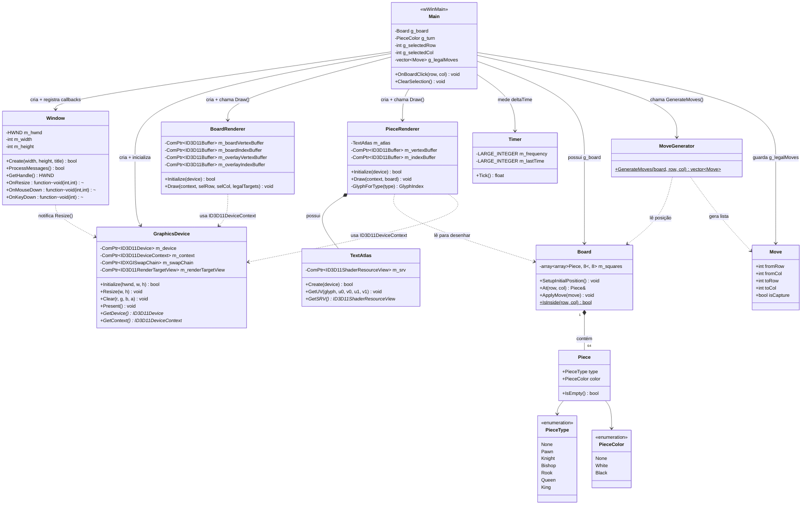
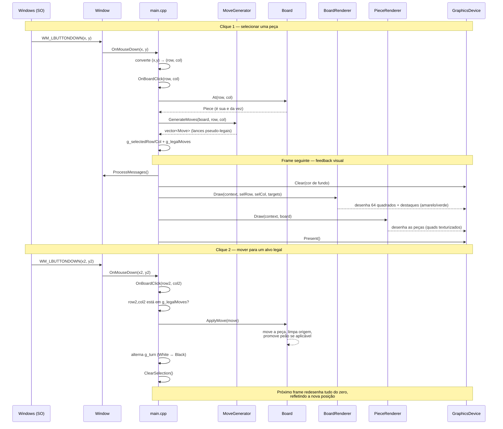

# Arquitetura do Jogo de Xadrez Didático

Este documento apresenta o diagrama de classes UML do projeto, um diagrama
de sequência do fluxo de um lance completo, e a explicação de como as
peças se conectam em tempo de execução.

---

## 1. Diagrama de Classes



**Como ler as setas:** `-->` (seta cheia) indica que uma classe *possui ou
controla* a outra; `..>` (seta tracejada) indica uma *dependência de
leitura/uso*, sem posse; `*--` indica *composição* (o todo não existe sem
as partes — um `Board` sem `Piece` não faz sentido).

---

## 2. Diagrama de Sequência — um lance completo



---

## 3. Explicação do fluxo, por etapa

### 3.1 Inicialização (uma única vez)

A ordem de criação em `wWinMain` é uma cadeia de dependências:

```
Window  →  GraphicsDevice  →  BoardRenderer / PieceRenderer
(precisa    (precisa do        (precisam do ID3D11Device
 de nada)    HWND da janela)    criado pelo GraphicsDevice)
```

Cada `Initialize()` só pode ser chamado depois que a etapa anterior
retornou `true`. Se qualquer uma falhar, o programa encerra com `-1` em
vez de continuar com ponteiros DirectX inválidos.

### 3.2 O game loop (repete a cada frame)

```
ProcessMessages()  →  Clear()  →  BoardRenderer::Draw()  →  PieceRenderer::Draw()  →  Present()
```

`ProcessMessages()` é o que faz a janela responder ao Windows — e é
*indiretamente*, através da fila de mensagens, que um clique do mouse
acaba chamando `OnBoardClick`. O `deltaTime` do `Timer` já é calculado
todo frame, mas ainda não é consumido por nada (fica reservado para
animações futuras de movimento).

### 3.3 A camada que nunca muda: `game/`

`Board`, `Piece`, `Move` e `MoveGenerator` não incluem nada de DirectX.
Eles representam o estado do xadrez como dados puros (uma matriz 8×8 de
`Piece`) e regras puras (funções que leem esse estado e devolvem listas
de `Move` válidos). Isso significa que, em teoria, você poderia escrever
testes automatizados para `MoveGenerator::GenerateMoves` sem nunca abrir
uma janela — a lógica do jogo é completamente independente de como ela é
desenhada.

### 3.4 A camada que traduz estado em pixels: `render/`

`BoardRenderer` e `PieceRenderer` nunca modificam `Board` — eles só o
leem (setas tracejadas `..>` no diagrama de classes). A cada frame, eles
reconstroem a geometria do zero a partir do estado atual:

- `BoardRenderer` sempre desenha os mesmos 64 quadrados (geometria
  estática, criada uma única vez), mas recalcula os destaques (seleção e
  alvos legais) a cada frame, porque esses mudam com a interação.
- `PieceRenderer` varre a matriz inteira do `Board` a cada frame e gera
  um quad texturizado para cada casa ocupada, usando as coordenadas UV
  que `TextAtlas` calcula para cada tipo de peça.

### 3.5 O ponto de encontro: `main.cpp`

`main.cpp` é a única parte do código que conhece **tanto** `game/`
quanto `render/` — é ele quem lê o clique, pergunta ao `MoveGenerator`
quais são os lances válidos, aplica o lance escolhido no `Board`, e then
passa esse mesmo `Board` para os renderizadores desenharem. Nem `game/`
nem `render/` se conhecem diretamente; `main.cpp` é a "cola" entre eles —
isso é o que o diagrama de classes expressa com `Main` sendo a única
classe com setas cheias (posse) apontando para praticamente tudo.

---

## 4. Onde ficam os "buracos" propositais

Como vimos em conversas anteriores, `MoveGenerator` gera apenas lances
**pseudo-legais**. No diagrama de sequência acima, isso corresponde ao
passo `MG-->>Main: vector<Move>` — nenhuma verificação de xeque acontece
ali. Implementar essa verificação adicionaria uma nova dependência no
diagrama: `MoveGenerator` (ou uma nova classe `LegalMoveFilter`) passaria
a depender de uma cópia temporária de `Board` para simular cada lance
antes de confirmá-lo como legal.
